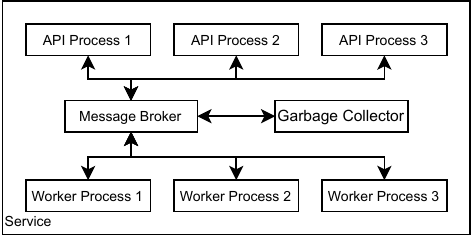

Concepts
========

This section explains how to apply the ESG framework and gives an overview of the basic technical concepts.  For more in-depth information especially regarding the discussion of the approach, please refer to the published `research article <https://doi.org/10.48550/arXiv.2402.15230>`__.

Framework
---------
The below figure shows the basic architecture of an EMS that integrates the ESG framework.

   EMS Architecture

The API of the framework is based on the RESTful principles with authorization being handled through JSON Web Tokens (JWTs). It enables the 

* retrieval of a forecast or optimized schedule and
* fitting of system specific parameters of a service.

The intended interaction of the EMS with the API, consists of the following calls in the given order:

1. Issue a POST call to the ``/{version}/request`` or to the ``/{version}/fit-parameters/`` endpoint.
2. Poll the GET endpoint ``/{version}/request/{task_ID}/status/``  or ``/{version}/fit-parameters/{task_ID}/status/`` respectively for the status of the job initiated in step 1. The task_ID is returned in the response of the POST call.
3. Once the status is ``ready``, issue a GET call to the ``/{version}/request/{task_ID}/result/`` or ``/{version}/fit-parameters/{task_ID}/result/`` endpoint to retrieve the result of the computation.

The format of the input data for calls to the ``/request/`` and ``/fit-parameters/`` endpoints and of the output returned by the corresponding ``/result/`` endpoints has to be specified by the developer. However, the ESG package provides building blocks for data models (see section :ref:`data_model`) to reduce the time spent on defining them.

Service Components
------------------
A functional service that implements a forecasting or optimization algorithm consists of three categories of components:

1. **Base**: Contains the components necessary for executing the code of the service.
2. **Service Framework**: Contains all components generic to all services.
3. **Service Specific**: Contains all components a service provider must implement to derive a functional service.

   
   Service Components

The worker, which is the second component within the service framework, enables concurrent processing of requests, effectively decoupling the API from interacting with forecasting or optimization code. To enhance performance, the worker and API should be operated in distinct processes connected only through a message broker.

   
   Full Service Architecture

The illustration above shows the full architecture of a service. The API is the entry point for the client software and interacts with the worker through the message broker. For each valid POST request, the API publishes a task on the message broker and assigns it a unique ID. A worker then fetches the task and starts computing the result. It regularly publishes status updates on the processing progress to the broker and finally the result of the computation. If the EMS calls the ``/status/`` endpoint, the API fetches the latest update regarding the corresponding task and returns the information to the client. Accordinngly, if the EMS calls the ``/result/`` endpoint, the API fetches the result from the broker and returns it to the client. 
To ensure the message broker is kept clean, a garbage collector deletes task-related data from the broker that are likely not required anymore. 

Operation Concepts
------------------
All components, also referred to as processes, of the service need to be wrapped in individual Docker containers in order to enable parallel execution of multiple instances of the same process and distribution of the processes across different machines. 
For commercial applications, the orchestrator `Kubernetes <https://kubernetes.io/>`__ is well suited, while academic applications are well off choosing `Docker Swarm <https://docs.docker.com/engine/swarm/>`__ as an orchestrator.

There are two supportive applications that service providers will habe to operate:

* A **Gateway** (also known as an ingress or reverse proxy): This makes the API containers accessible to the EMS and balances the distribution of requests across the API containers. Ideally, it also takes care of encrypting the communication between the client and the service through HTTPS.
* An **Identity Provider (IdP)**: The IdP issues the JWT tokens to the client software using the OpenID Connect (OIDC) protocol (e.g. the application `Keycloak <https://www.keycloak.org/>`__).

Implementation
==============
A reference implementation of the design concept can be found in `open source repository <https://github.com/fzi-forschungszentrum-informatik/energy-service-generics>`__. While this implementation is in Python, the concepts are described sufficiently generic to allow for implementation in another programming language, e.g., Java. 

Inter-process Communication
---------------------------
The ESG utilizes an open source python library for distributed task execution. `celery <https://github.com/celery/celery>`__ is here employed for the inter-process communication between API and worker. It is worth noting that celery supports different message brokers, e.g. Redis and RabbitMQ.

Worker
------
The worker uses celery to interact with the message broker. ESG Framework already provides a generic worker that invokes the service specific forecasting or optimization code in the ESG package.* 

Garbage Collector
-----------------
 The garbage collector integrated in the ESG framework is the one provided by celery. Depending on the choice of the message broker no dedicated process is required (`see celery documentation <https://docs.celeryq.dev/en/stable/userguide/configuration.html#result-expires>`__). 

API
---
The framework selected for the implementation of the API is `FastAPI <https://fastapi.tiangolo.com/>`__. FastAPI already provides some functionality out of the box, such as automatic generation of OpenAPI schema documents and SwaggerUI. They can usually be accessed at `localhost:8800 <localhost:8800>`__. 

The API is fully functional, except for the definition of the data models. Service providers only have to define the input data for the ``POST /request/`` and ``POST /fit-parameters/ `` API methods and the corresponding  output data for the ``GET /result/`` API methods. As mentioned above, the ESG package contains building blocks for data models to reduce time spent on defining them (see section :ref:`data_model`). The data format for all data exchange is JSON. 

The example implementation utilizes `PyJWT <https://pyjwt.readthedocs.io/en/stable/>`__ to verify calls to the API endpoints before using celery to publish tasks to the message broker.

Additional Functionality
------------------------
* **Generic Client**: The ESG package comes with a generic client that can be used to trigger calls to services from python source code.
* **Utility functions**: The ESG packages includes useful utility functions, e.g., for parsing pandas DataFrames from JSON data.
